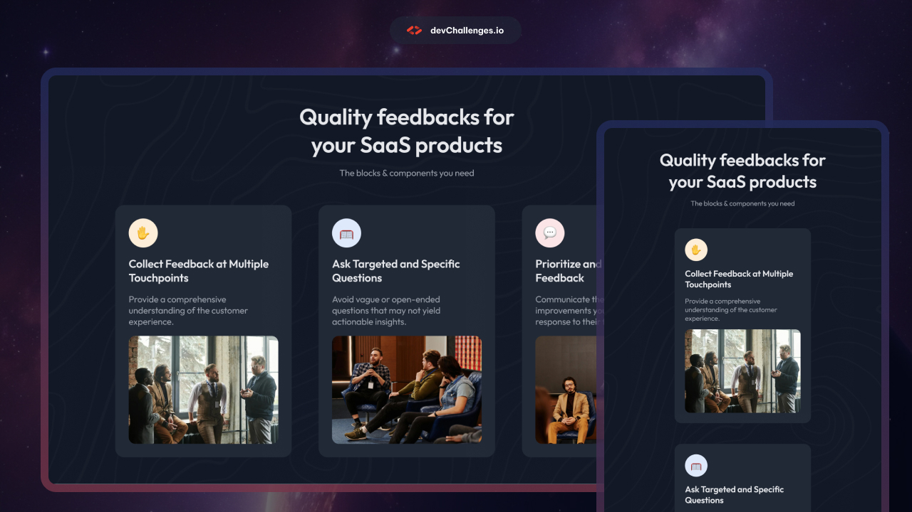

<h1 align="center">Simple Feature Section | devChallenges</h1>

   Solution for a challenge <a href="https://devchallenges.io/challenge/simple-feature-section-challenge" target="_blank">Simple Feature Section</a> from <a href="http://devchallenges.io" target="_blank">devChallenges.io</a>.

  <h3>
    <a href="https://emigarcia377.github.io/Simple-feature-section-devCh/">
      Demo
    </a>
     | 
    <a href="https://github.com/EmiGarcia377/Simple-feature-section-devCh.git">
      Solution
    </a>
     | 
    <a href="https://devchallenges.io/challenge/simple-feature-section-challenge">
      Challenge
    </a>
  </h3>

<!-- TABLE OF CONTENTS -->

## Table of Contents

- [Overview](#overview)
  - [What I learned](#what-i-learned)
- [Built with](#built-with)
- [Features](#features)

## Overview

In this project i practiced with a little CSS Flexbox and HTML, I also learned how to make the website responsive with media queries in CSS.

### What I learned

I have learned more about how CSS Flexbox works by using it for all the website structure and making it responsive.

### Built with

- Semantic HTML5 markup
- CSS custom properties
- Flexbox

## Features

- A responsive design
- Use of CSS Flexbox

This application/site was created as a submission to a [DevChallenges](https://devchallenges.io/challenges-dashboard) challenge.

## Author

- GitHub [@EmiGarcia377](https://github.com/EmiGarcia377)
